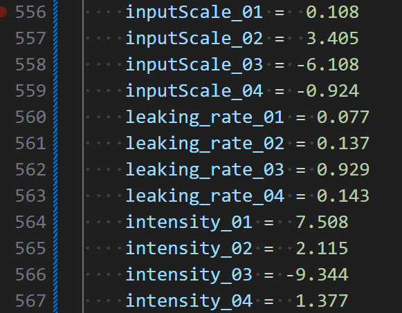

# Reservoir_ESN
- 2024年度修士了の石橋涼輔の研究をまとめたもの
- リザバーコンピューティングモデルの一種であるEcho State Networkを使用して，線虫$C.elegans$の嗅覚神経細胞AWAの膜電位応答を再現した
- とりあえず実行したい方向け[shellの使い方](#shellの使い方)

## フォルダ構成

```
.
├── classification      膜電位応答から，線虫に与えられた匂い刺激の濃度の分類を行う(未完成)
├── input               教師データ(実際の線虫の膜電位応答データ)
├── models              モデル構造を書いたコード
├── orglib              もろもろの処理をまとめたもの
├── output              出力データ
├── reproduction        濃度刺激を模した波形から膜電位応答を再現する
└── test                モデルの特性をチェックするもの
```
### クイックアクセス
- [input](#inputフォルダ)
- [models](#modelsフォルダ)
- [orglib](#orglibフォルダ)
- [output](#outputフォルダ)
- [reproduction](#reproductionフォルダ)


# inputフォルダ

- 教師データとして使用した，実際の線虫の膜電位応答データがある
- 主に`original_data_csv`フォルダのデータを使用
    - Mechanism of sensory perception unveiled by simultaneous measurement of membrane voltage and intracellular calcium のデータ
    - フォルダ名と図表番号は対応している


<!-- [^unveiled]:Tokunaga, Terumasa, et al. "Mechanism of sensory perception unveiled by simultaneous measurement of membrane voltage and intracellular calcium." Communications Biology 7.1 (2024): 1150. -->


# modelsフォルダ

- ESNモデルの実装を行っている
- `model3.py`が最新
    - 後方互換もあるのでこれを使用していれば問題ないはず


# orglibフォルダ

- こまごました処理をまとめたもの
- 主にデータの読み込みとデータセットの作成を行っている


# outputフォルダ

- 出力データをまとめたもの
- 大体プログラムを実行した日付ごとにフォルダが存在する
    - 一部数日分の結果がまとまってるものもある
- モデル出力を可視化した画像データ，optunaのlogデータ(github上ではignoreされてる)，モデル出力のテキストデータが含まれる
- 修論で使用した範囲のデータは以下のようになる
    ```
    output
    ├── 20250120    実験2
    ├── 20250122    実験1
    ├── 20250123    実験2
    ```


# reproductionフォルダ

- 研究で主に使用していたフォルダ
```
reproduction
├── reproduct2.sh               主に結果表示の際に使用したshell，reproduction21.pyを呼び出す
├── reproduct3.sh               optunaでの最適化の際に使用したshell，reproduction22.pyを呼び出す
├── reproduction21.py           主に結果を出力するためのコード
├── reproduction22.py           optunaの実行ができるようにしたコード
├── visualization_optuna.ipynb  optunaの実行結果を可視化するためのnotebook
```

## shellの使い方

### reproduct2.sh

- `reproduction21.py`を呼び出すshell
- 実行するときは`FIG_SAVE_PATH, FIG_NAME`と`--mode`適切に設定する
    - ほかのオプションは必要に応じて変更する
- **実験再現するときは`reproductin21.py`の556-567を変更する必要がある**
    - [各数値の取得法](#visualization_optuna.ipynbの使い方)

    

- 実験1では495を，実験2では496を使用する

    

### reproduct3.sh

- `reproduction22.py`を呼び出すshell
- optunaを使用してハイパーパラメータの最適化を行う
- 実行するときは`STUDY_NAME`と`--mode`を適切に設定する
    - ほかのオプションは必要に応じて変更する
- 使用するGPU番号の設定場所

    


## visualization_optuna.ipynbの使い方

- optunaでの実行結果を可視化する
- `結果のロード`セクションの3,4行目を変えることで欲しいデータを取得する

    

<details><summary>[参考]データベースへのアクセス方法</summary>

- optunaでの並列化のために`mySQL`を使用している
- アカウント情報と簡単な操作法

```
# アカウント情報
username : ishibashi (root権限あり)
password : 無し

# mysqlコマンド

## mysqlに入る(-pはオプション)
mysql -u [username] -p [password]

## databaseやtableを見る
show databases;
show tables;

## databaseに入る
use [database name]

## テーブルの操作は通常のsqlと同様
```

</details>

